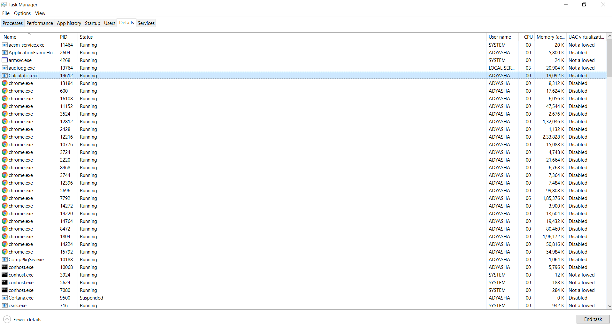

# module2
Assignment 1
Process Management :

Collect process information using the Task Viewer - PID.png and Process Information.png

Terminate a specific process using Windows PowerShell - Terminate a specific process.png
Terminate multiple processes using Windows PowerShell - Terminate multiple processes.png
